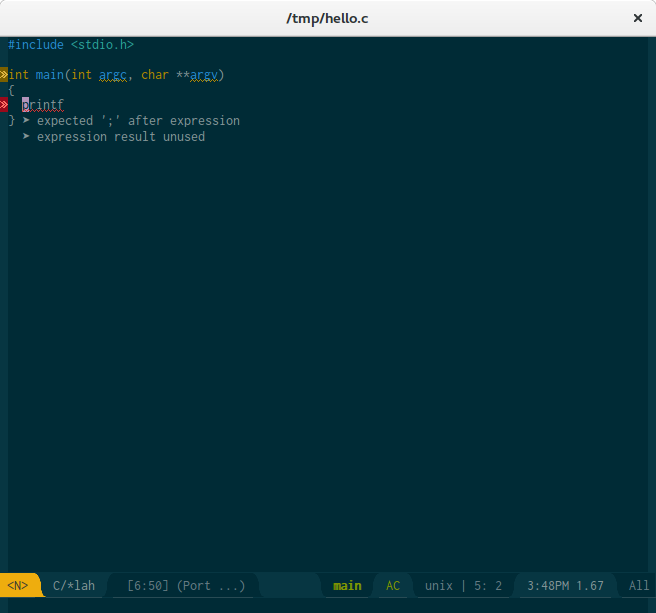

# flycheck-posframe

[](http://www.gnu.org/licenses/gpl-3.0.txt)
[](http://melpa.org/#/flycheck-posframe)
[](https://travis-ci.org/alexmurray/flycheck-posframe)

Display flycheck error messages via
[posframe](https://github.com/tumashu/posframe).



## Installation

### MELPA

The preferred way to install `flycheck-posframe` is via
[MELPA](http://melpa.org) - then you can just <kbd>M-x package-install RET
flycheck-posframe RET</kbd>

To enable then simply add the following to your init file:

```emacs-lisp
(with-eval-after-load 'flycheck
  (require 'flycheck-posframe)
  (add-hook 'flycheck-mode-hook #'flycheck-posframe-mode))
```

We recommend to use [use-package](https://github.com/jwiegley/use-package) to
make this automatic:

```emacs-lisp
(use-package flycheck-posframe
  :ensure t
  :after flycheck
  :config (add-hook 'flycheck-mode-hook #'flycheck-posframe-mode))
```

### Manual

If you would like to install the package manually, download or clone it and
place within Emacs' `load-path`, then you can require it in your init file like
this:

```emacs-lisp
(require 'flycheck-posframe)
(add-hook 'flycheck-mode-hook #'flycheck-posframe-mode)
```

NOTE: This will also require the manual installation of `flycheck` if you have
not done so already.

## Configuration

### Default Pretty Configuration

Calling `(flycheck-posframe-configure-pretty-defaults)` will configure
`flycheck-posframe` to show warnings and errors with nicer faces (inheriting
from `warning` and `error` respectively), and set the prefix for each to nicer
unicode characters.

### Manual Configuration

There are a few settings which can be configured to customise the display
of error messages. These include the faces which are used to show the error
messages `flycheck-posframe-info-face`, `flycheck-posframe-warning-face`
and `flycheck-posframe-error-face` and a string which is used as the prefix
for each message
`flycheck-posframe-info-prefix``flycheck-posframe-warning-prefix` and
`flycheck-posframe-error-prefix`. The background colour can be specified as
the `background` attribute of the `flycheck-posframe-background-face`
face. `The position, as well as the border width and colour can also be
customised via the `flycheck-posframe-position`,
`flycheck-posframe-border-width` and `flycheck-posframe-border-color`
variables respectively.

#### `flycheck-posframe-LEVEL-face`

By default each of `flycheck-posframe-LEVEL-face` inherits from the `default`
face so should appear like the rest of the text in the buffer. If however you
want to ensure error messages stand-out you could configure them to inherit
from the `error` face:

```
(set-face-attribute 'flycheck-posframe-error-face nil :inherit 'error)
```

#### `flycheck-posframe-LEVEL-prefix`

By default `flycheck-posframe-LEVEL-prefix` is set to "➤ ". If however you
wanted to show each warning message prefixed with the unicode WARNING SIGN symbol
(U+26A0) "⚠ " you could configure it as follows:

```
(setq flycheck-posframe-warning-prefix "\u26a0 ")
```

#### `flycheck-posframe-background-face`

By default `flycheck-posframe-background-face` inherits from the default
face, so the background colour should be the same as the standard window
frame background colour. This can be customised like any other face (ie. by
using `customize-face` or manually setting the `:background` face
attribute)

#### `flycheck-posframe-border-face`

By default `flycheck-posframe-border-face` inherits from the default face,
so the background colour should be the same as the standard foreground
colour. This can be customised like any other face (ie. by using
`customize-face` or manually setting the `:foreground` face attribute)

#### `flycheck-posframe-border-width`

By default `flycheck-posframe-border-width` is zero but this can be set to
an integer number of pixels to specify the width of the border.

#### `flycheck-posframe-position`

By default `flycheck-posframe-position` is set to
`point-bottom-left-corner` so that errors are shown just below point. This
can be customised to any of the existing positions supported by
`posframe`. For example, to display errors at the bottom-left of the
window:

```
(setq flycheck-posframe-position 'window-bottom-left-corner)
```

## License

Copyright © 2019 Alex Murray

Distributed under GNU GPL, version 3.
